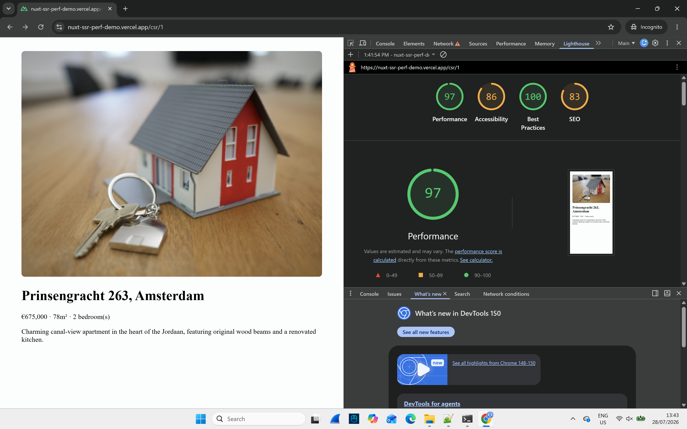
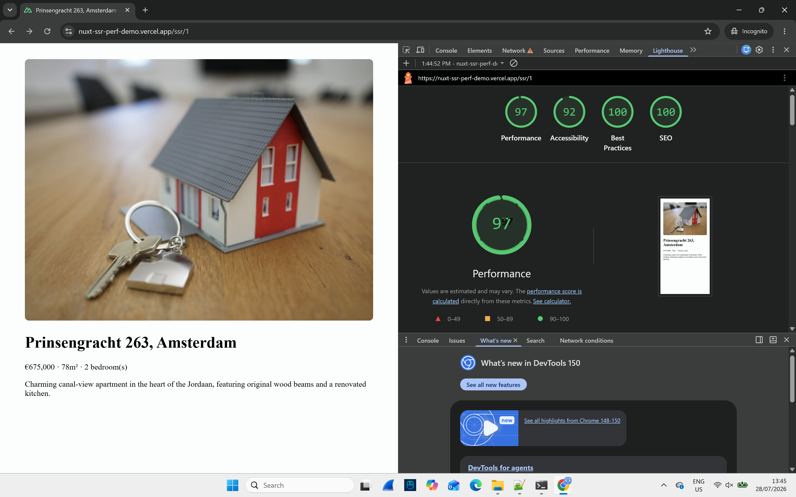

# Nuxt 3/4 SSR vs CSR, measured not claimed

A minimal Nuxt app comparing two rendering strategies for the same listing page: naive client side rendering vs. SSR plus ISR. Real Lighthouse runs, not estimated numbers.

**Live demo:** https://nuxt-ssr-perf-demo.vercel.app/csr/1 vs https://nuxt-ssr-perf-demo.vercel.app/ssr/1

## The result

| | CSR (`/csr/1`) | SSR + ISR (`/ssr/1`) |
|---|---|---|
| Performance | 97 | 97 |
| Accessibility | 86 | 92 |
| Best Practices | 100 | 100 |
| **SEO** | **83** | **100** |




Performance is basically a wash here. Vercel's CDN keeps both fast. The real, measurable difference is SEO.


The CSR version fails two audits: "Document doesn't have a `<title>` element" and "Document does not have a meta description." The page is empty until client JS runs and fetches data, so a crawler (or a link preview) sees nothing. The SSR version resolves both server side via `useSeoMeta`, so the real title and description are in the initial HTML response instead of being added after the fact.

This also shows up in `view-source`, not just the rendered page. The SSR response contains the fully resolved `<title>`, `<meta name="description">`, and OG tags, plus the listing content itself, all before any JS executes.

## Why SSR plus ISR, not just SSR or full static

Full static (SSG) would go stale the moment listing data changes, since prices and availability update independently of any deploy. Plain SSR re renders on every single request, which is wasteful for content that doesn't change every second. ISR (`routeRules: { '/ssr/**': { isr: 60 } }`) caches the rendered page and regenerates it in the background after the TTL expires, giving near static speed with periodic freshness. 60s here is deliberately short for demo purposes. A real listings site would tune this much higher.

## A real bug, found and fixed

The initial SSR build threw a Vue hydration warning:

```
Hydration text content mismatch
rendered on server: €675.000 · 78m² · 2 bedroom(s)
expected on client: €675,000 · 78m² · 2 bedroom(s)
```

`toLocaleString()` without an explicit locale let server and client disagree on thousands separators. Fixed by pinning `toLocaleString('en-US')` in both places the price is rendered, so output is deterministic regardless of the runtime's default locale.

## Error handling

`/ssr/999` (a listing that doesn't exist) returns a real HTTP 404 through `createError`, with a matching page title. Crawlable and correct. `/csr/999` returns 200 OK with "not found" text rendered client side after the fact. That's a subtle but real SEO problem, since a crawler indexes it as a valid page with thin content instead of recognizing it as missing.

## Stack

Nuxt 4, TypeScript, deployed on Vercel. Fake dataset (3 listings) served from a Nitro API route (`server/api/listings.get.ts`) so both page versions read from the same source.

## Running it locally

```bash
npm install
npm run dev
```

Visit `/csr/1` and `/ssr/1` to compare. Node version is pinned in `.nvmrc`.

## Limitations

Fake dataset with 3 hardcoded listings, no real backend latency. Lighthouse runs are single region (whatever Vercel's default deploy region is), not multi region. ISR revalidation is configured and deployed correctly but hasn't been separately load tested under concurrent traffic. Some dev dependency audit warnings exist, traced to a single brace-expansion DoS advisory inside Nuxt's own build tooling. Not exploitable in this project's context since it's build time tooling, not user facing runtime code, but left unresolved rather than forcing a breaking downgrade of test-utils. Separately, @nuxt/image pulls in sharp, which has open libvips CVEs with no fix available yet. This one is runtime image processing, not just build tooling, so it would matter more on a real site accepting user uploaded photos. Here the only images processed are a fixed, hardcoded set of Unsplash URLs, so the practical attack surface is closed, but this is worth re-checking before reusing this pattern with untrusted image sources.